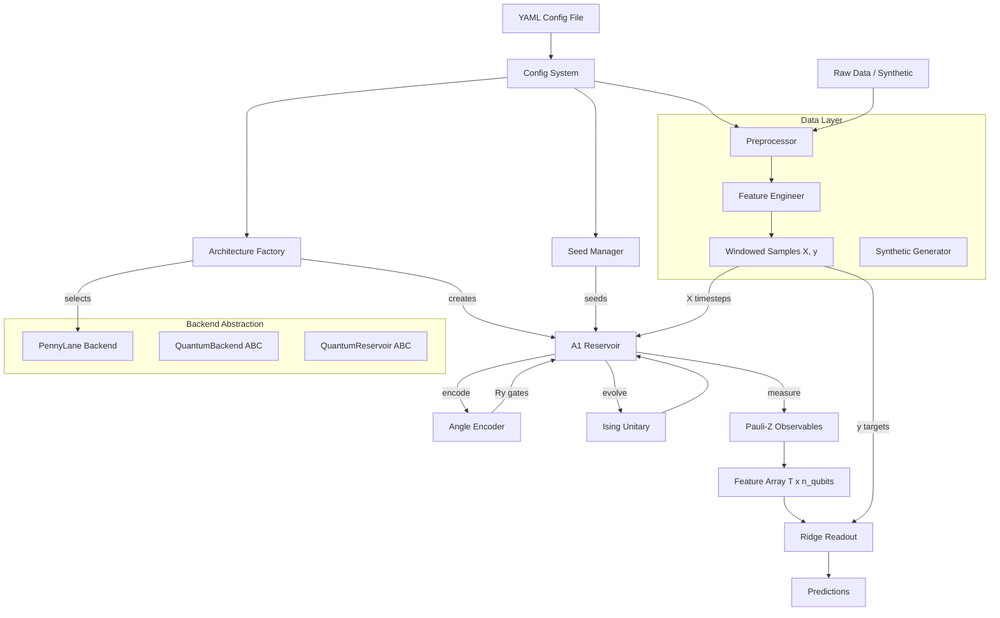
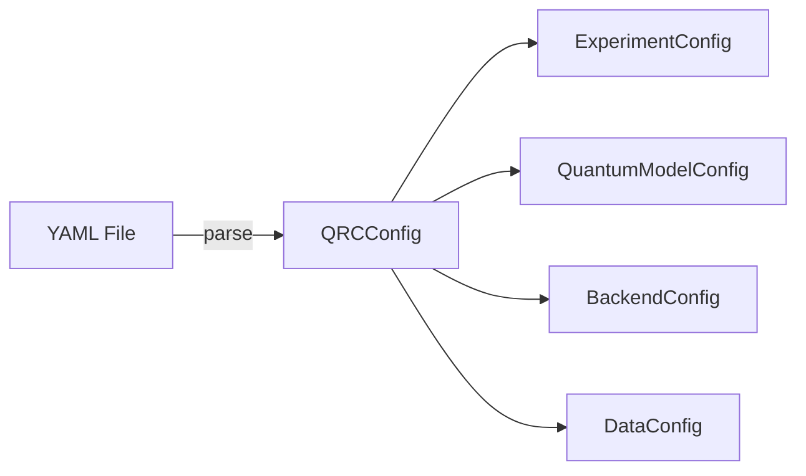

# Design Document: Phase 1 Foundation Setup

## Overview

This design covers the foundational infrastructure for QRC-EV: a Python package providing quantum reservoir computing for EV charging demand forecasting. Phase 1 delivers a minimal but complete pipeline from YAML configuration through data preprocessing, quantum reservoir processing (A1 Standard QRC with angle encoding on PennyLane), observable extraction, and ridge regression prediction.

The architecture follows a layered approach: abstract base classes define the quantum backend and reservoir interfaces, concrete implementations provide PennyLane support, and a factory pattern enables configuration-driven instantiation. Data flows through a preprocessing pipeline that handles normalization, feature engineering, and windowing before reaching the quantum layer.

Technology stack: Python 3.10+, PennyLane ≥0.39, NumPy, SciPy, scikit-learn, PyYAML, pytest, mypy.

## Architecture



The system has three main subsystems:

1. **Configuration & Orchestration**: YAML config loading with inheritance, seed management, and factory-based component creation.
2. **Data Layer**: Preprocessing pipeline (aggregation, normalization, windowing), feature engineering (temporal sin/cos, lags), and synthetic data generation for testing.
3. **Quantum Pipeline**: Backend abstraction (ABC → PennyLane), angle encoding, A1 reservoir with fixed Ising unitary, Pauli-Z measurement, and ridge regression readout.

## Components and Interfaces

### 1. Backend Abstraction (`src/qrc_ev/backends/`)

```python
# base.py
from abc import ABC, abstractmethod
from dataclasses import dataclass, field
import numpy as np
from typing import Any

@dataclass
class ReservoirParams:
    n_qubits: int
    n_layers: int
    coupling_strengths: np.ndarray  # shape (n_layers, n_qubits, n_qubits)
    rotation_angles: np.ndarray     # shape (n_layers, n_qubits)
    seed: int

class QuantumBackend(ABC):
    @abstractmethod
    def create_circuit(self, n_qubits: int) -> Any: ...

    @abstractmethod
    def apply_encoding(self, circuit: Any, data: np.ndarray,
                       strategy: str = "angle") -> Any: ...

    @abstractmethod
    def apply_reservoir(self, circuit: Any,
                        params: ReservoirParams) -> Any: ...

    @abstractmethod
    def measure_observables(self, circuit: Any,
                            obs_set: str = "pauli_z") -> np.ndarray: ...

    @abstractmethod
    def execute(self, circuit: Any, shots: int = 0) -> Any: ...


class QuantumReservoir(ABC):
    @abstractmethod
    def encode(self, x: np.ndarray) -> None: ...

    @abstractmethod
    def evolve(self, steps: int) -> None: ...

    @abstractmethod
    def measure(self) -> np.ndarray: ...

    @abstractmethod
    def process(self, time_series: np.ndarray) -> np.ndarray: ...

    @abstractmethod
    def reset(self) -> None: ...
```

### 2. PennyLane Backend (`src/qrc_ev/backends/pennylane_backend.py`)

```python
class PennyLaneBackend(QuantumBackend):
    def __init__(self, device_name: str = "default.qubit", shots: int = 0):
        self.device_name = device_name
        self.shots = shots

    def create_circuit(self, n_qubits: int) -> Any:
        # Returns a qml.device configured with n_qubits
        ...

    def apply_encoding(self, circuit, data, strategy="angle"):
        # For "angle": applies qml.RY(pi * x_i, wires=i)
        ...

    def apply_reservoir(self, circuit, params):
        # Applies Ising-type unitary:
        # For each layer: Rz(theta_i) on each qubit, then CNOT+Rz(J_ij) for couplings
        ...

    def measure_observables(self, circuit, obs_set="pauli_z"):
        # Returns [qml.expval(qml.PauliZ(i)) for i in range(n_qubits)]
        ...

    def execute(self, circuit, shots=0):
        # shots=0: exact statevector, shots>0: sampling
        ...
```

The PennyLane backend constructs QNodes dynamically. Each `process()` call on the reservoir builds a circuit: encoding gates → reservoir layers → measurement. The QNode is executed via the configured device.

### 3. Angle Encoding (`src/qrc_ev/encoding/angle.py`)

```python
def angle_encode(data: np.ndarray, n_qubits: int) -> None:
    """Apply Ry(pi * x_i) to qubit i for each feature.

    Args:
        data: Input vector of shape (d,) with values in [0, 1].
        n_qubits: Total number of qubits available.

    Raises:
        ValueError: If d > n_qubits.
    """
    if len(data) > n_qubits:
        raise ValueError(
            f"Input dimension {len(data)} exceeds qubit count {n_qubits}"
        )
    for i, x in enumerate(data):
        qml.RY(np.pi * x, wires=i)
```

### 4. A1 Standard Reservoir (`src/qrc_ev/reservoirs/standard.py`)

```python
class StandardReservoir(QuantumReservoir):
    def __init__(self, backend: QuantumBackend, n_qubits: int,
                 n_layers: int, evolution_steps: int, seed: int):
        self.backend = backend
        self.n_qubits = n_qubits
        self.n_layers = n_layers
        self.evolution_steps = evolution_steps
        self.params = self._generate_fixed_params(seed)

    def _generate_fixed_params(self, seed: int) -> ReservoirParams:
        rng = np.random.default_rng(seed)
        coupling_strengths = rng.uniform(-np.pi, np.pi,
                                          (self.n_layers, self.n_qubits, self.n_qubits))
        rotation_angles = rng.uniform(-np.pi, np.pi,
                                       (self.n_layers, self.n_qubits))
        return ReservoirParams(
            n_qubits=self.n_qubits,
            n_layers=self.n_layers,
            coupling_strengths=coupling_strengths,
            rotation_angles=rotation_angles,
            seed=seed,
        )

    def process(self, time_series: np.ndarray) -> np.ndarray:
        """Process (T, d) input → (T, n_qubits) feature array."""
        features = []
        for t in range(time_series.shape[0]):
            self.reset()
            self.encode(time_series[t])
            self.evolve(self.evolution_steps)
            features.append(self.measure())
        return np.array(features)
```

### 5. Pauli-Z Observables (`src/qrc_ev/readout/observables.py`)

```python
def pauli_z_observables(n_qubits: int) -> list:
    """Return PennyLane observable list for single-qubit Z expectations."""
    return [qml.expval(qml.PauliZ(i)) for i in range(n_qubits)]
```

### 6. Ridge Readout (`src/qrc_ev/readout/ridge.py`)

```python
class RidgeReadout:
    def __init__(self, alpha: float = 1e-4):
        self.alpha = alpha
        self._weights: np.ndarray | None = None

    def fit(self, features: np.ndarray, targets: np.ndarray) -> "RidgeReadout":
        if features.shape[0] != targets.shape[0]:
            raise ValueError("Feature and target sample counts must match")
        X, y = features, targets
        self._weights = np.linalg.solve(
            X.T @ X + self.alpha * np.eye(X.shape[1]),
            X.T @ y,
        )
        return self

    def predict(self, features: np.ndarray) -> np.ndarray:
        if self._weights is None:
            raise RuntimeError("Must call fit() before predict()")
        return features @ self._weights
```

### 7. Configuration System (`src/qrc_ev/utils/config.py`)

```python
@dataclass
class ExperimentConfig:
    name: str
    seeds: list[int]
    metrics: list[str] = field(default_factory=lambda: ["rmse", "r2"])

@dataclass
class QuantumModelConfig:
    arch: str
    n_qubits: int
    n_layers: int = 4
    evolution_steps: int = 1
    encoding: str = "angle"
    observables: str = "pauli_z"

@dataclass
class BackendConfig:
    name: str = "pennylane"
    device: str = "default.qubit"
    shots: int = 0

@dataclass
class DataConfig:
    dataset: str = "synthetic"
    resolution: str = "1h"
    window_size: int = 24
    forecast_horizon: int = 1
    train_ratio: float = 0.7
    val_ratio: float = 0.15
    test_ratio: float = 0.15

@dataclass
class QRCConfig:
    experiment: ExperimentConfig
    quantum_model: QuantumModelConfig
    backend: BackendConfig
    data: DataConfig

def load_config(path: str) -> QRCConfig:
    """Load YAML config, resolving inheritance via 'extends' field."""
    ...

def dump_config(config: QRCConfig) -> str:
    """Serialize config to YAML string."""
    ...
```

### 8. Seed Manager (`src/qrc_ev/utils/seed.py`)

```python
class SeedManager:
    def __init__(self, global_seed: int | None = None):
        if global_seed is None:
            global_seed = int(np.random.default_rng().integers(0, 2**31))
            logger.info(f"Generated random seed: {global_seed}")
        self.global_seed = global_seed

    def seed_all(self) -> None:
        """Seed Python random, NumPy, and log the seed."""
        random.seed(self.global_seed)
        np.random.seed(self.global_seed)

    def derive_seed(self, component: str) -> int:
        """Derive a deterministic child seed for a named component."""
        # Hash-based derivation to avoid correlation
        h = hashlib.sha256(f"{self.global_seed}:{component}".encode())
        return int.from_bytes(h.digest()[:4], "big") % (2**31)
```

### 9. Data Preprocessing (`src/qrc_ev/data/preprocessor.py`)

```python
class Preprocessor:
    def __init__(self, config: DataConfig):
        self.config = config
        self._train_stats: dict | None = None

    def aggregate_sessions(self, sessions: pd.DataFrame,
                           resolution: str) -> pd.Series:
        """Aggregate session-level data to fixed time bins."""
        ...

    def handle_missing(self, series: pd.Series,
                       max_gap: int = 4) -> pd.Series:
        """Forward-fill missing values; flag gaps exceeding threshold."""
        ...

    def clip_outliers(self, series: pd.Series,
                      n_sigma: float = 3.0) -> pd.Series:
        """Clip values beyond ±n_sigma standard deviations."""
        ...

    def split_chronological(self, data: np.ndarray
                            ) -> tuple[np.ndarray, np.ndarray, np.ndarray]:
        """Split into train/val/test chronologically."""
        ...

    def fit_normalize(self, train_data: np.ndarray) -> None:
        """Compute min/max from training data only."""
        ...

    def normalize(self, data: np.ndarray) -> np.ndarray:
        """Apply min-max normalization to [0, 1], clip out-of-range."""
        ...

    def create_windows(self, features: np.ndarray, targets: np.ndarray,
                       window_size: int, horizon: int
                       ) -> tuple[np.ndarray, np.ndarray]:
        """Generate (X, y) sliding window pairs."""
        ...
```

### 10. Feature Engineering (`src/qrc_ev/data/feature_engineer.py`)

```python
class FeatureEngineer:
    def __init__(self, lag_steps: list[int] | None = None):
        self.lag_steps = lag_steps or [1, 2, 4, 12, 24]

    def add_temporal_features(self, timestamps: pd.DatetimeIndex
                              ) -> np.ndarray:
        """Generate sin/cos for hour-of-day and day-of-week."""
        ...

    def add_lag_features(self, series: np.ndarray) -> np.ndarray:
        """Create lagged copies at configured steps."""
        ...

    def engineer(self, series: np.ndarray,
                 timestamps: pd.DatetimeIndex) -> np.ndarray:
        """Full feature engineering: temporal + lags. Returns (T, d)."""
        ...

    @property
    def feature_dim(self) -> int:
        """Total feature dimension after engineering."""
        ...
```

### 11. Synthetic Data Generator (`src/qrc_ev/data/synthetic.py`)

```python
class SyntheticGenerator:
    def __init__(self, seed: int = 42):
        self.rng = np.random.default_rng(seed)

    def sinusoidal(self, length: int = 500, n_features: int = 4,
                   noise_std: float = 0.1) -> tuple[np.ndarray, np.ndarray]:
        """Generate sinusoidal data. Returns (features, targets)."""
        ...

    def ev_charging_pattern(self, length: int = 720,
                            n_features: int = 4
                            ) -> tuple[np.ndarray, np.ndarray]:
        """Generate synthetic EV charging with daily/weekly periodicity."""
        # Morning peak ~8am, evening peak ~6pm
        # Weekday higher than weekend
        # Gaussian noise overlay
        ...
```

### 12. Architecture Factory (`src/qrc_ev/reservoirs/factory.py`)

```python
_REGISTRY: dict[str, type[QuantumReservoir]] = {
    "standard": StandardReservoir,
}

def create_reservoir(arch: str, backend: QuantumBackend,
                     **kwargs) -> QuantumReservoir:
    if arch not in _REGISTRY:
        raise ValueError(
            f"Unknown architecture '{arch}'. Available: {list(_REGISTRY)}"
        )
    return _REGISTRY[arch](backend=backend, **kwargs)
```

## Data Models

### Configuration Data Flow



### Core Data Structures

| Structure | Fields | Purpose |
|-----------|--------|---------|
| `ReservoirParams` | n_qubits, n_layers, coupling_strengths, rotation_angles, seed | Fixed random parameters for reservoir unitary |
| `QRCConfig` | experiment, quantum_model, backend, data | Top-level experiment configuration |
| `ExperimentConfig` | name, seeds, metrics | Experiment metadata |
| `QuantumModelConfig` | arch, n_qubits, n_layers, evolution_steps, encoding, observables | Quantum model hyperparameters |
| `BackendConfig` | name, device, shots | Backend selection and execution mode |
| `DataConfig` | dataset, resolution, window_size, forecast_horizon, train/val/test ratios | Data pipeline parameters |

### Data Shapes Through Pipeline

| Stage | Shape | Description |
|-------|-------|-------------|
| Raw input | (T_raw,) | Raw time-series values |
| After preprocessing | (T, d) features + (T,) targets | Normalized, engineered features |
| Windowed X | (N, W, d) | N samples, W window length, d features |
| Windowed y | (N, h) | N samples, h forecast horizon |
| Per-timestep to reservoir | (d,) | Single feature vector |
| Reservoir output | (n_qubits,) | Pauli-Z expectations per timestep |
| Feature matrix | (N, W × n_qubits) or (N, n_qubits) | Flattened reservoir features for readout |
| Ridge weights | (n_features, h) | Learned readout weights |
| Predictions | (N, h) | Forecast values |


## Correctness Properties

*A property is a characteristic or behavior that should hold true across all valid executions of a system — essentially, a formal statement about what the system should do. Properties serve as the bridge between human-readable specifications and machine-verifiable correctness guarantees.*

### Property 1: Angle encoding produces correct quantum state

*For any* input vector x with values in [0, 1] and dimension d ≤ n_qubits, the angle encoder should produce a quantum state where qubit i has been rotated by Ry(π × xᵢ), and any unused qubits (indices ≥ d) should remain in the |0⟩ state (⟨Z⟩ = 1.0).

**Validates: Requirements 4.1, 4.3, 4.4**

### Property 2: Angle encoding rejects oversized input

*For any* input vector x with dimension d > n_qubits, the angle encoder should raise a `ValueError`.

**Validates: Requirements 4.2**

### Property 3: Observable output dimension matches qubit count

*For any* n_qubits configuration, the Pauli-Z observable extractor should return exactly n_qubits expectation values, and the PennyLane backend's `measure_observables` should return an array of length n_qubits.

**Validates: Requirements 3.5, 6.1**

### Property 4: Pauli-Z values bounded in [-1, 1]

*For any* quantum state produced by the reservoir (any input data, any seed, any qubit count), all Pauli-Z expectation values should lie in the range [-1, 1].

**Validates: Requirements 6.2**

### Property 5: Reservoir process output shape invariant

*For any* input time-series of shape (T, d) where d ≤ n_qubits, the A1 reservoir's `process()` method should return a feature array of shape (T, n_qubits).

**Validates: Requirements 5.6**

### Property 6: Reservoir reset restores initial state

*For any* A1 reservoir that has processed data (encode + evolve), calling `reset()` and then `measure()` should return ⟨Zᵢ⟩ = 1.0 for all qubits, and the fixed random parameters should remain unchanged.

**Validates: Requirements 5.7**

### Property 7: Ridge regression solves regularized least squares

*For any* feature matrix X of shape (N, d) with N > d and target vector y, after fitting the Ridge_Readout with regularization α, the weights W should satisfy ‖(XᵀX + αI)W − Xᵀy‖ < ε (numerical tolerance), and `predict(X)` should return X @ W.

**Validates: Requirements 7.1, 7.2**

### Property 8: Ridge regression rejects mismatched dimensions

*For any* feature matrix X of shape (N, d) and target vector y of shape (M,) where N ≠ M, calling `fit(X, y)` should raise a `ValueError`.

**Validates: Requirements 7.4**

### Property 9: Configuration round-trip

*For any* valid `QRCConfig` object, serializing it to YAML via `dump_config()` and then parsing the result via `load_config()` should produce an equivalent configuration object.

**Validates: Requirements 8.7**

### Property 10: Configuration inheritance merge

*For any* base config and child config where the child specifies an `extends` field, the merged result should contain all base values not overridden by the child, and all child values should take precedence over base values.

**Validates: Requirements 8.2**

### Property 11: Invalid configuration raises ConfigError

*For any* YAML config that is missing a required field or contains an unknown field, the Config_System should raise a `ConfigError` with a descriptive message.

**Validates: Requirements 8.3, 8.4**

### Property 12: Seed reproducibility — reservoir outputs

*For any* seed, backend configuration, and input data, running the A1 reservoir twice with the same seed should produce identical feature arrays (element-wise equality).

**Validates: Requirements 9.2, 15.2**

### Property 13: Seed derivation produces distinct child seeds

*For any* global seed and two different component name strings, the Seed_Manager's `derive_seed()` should return different child seed values.

**Validates: Requirements 9.3**

### Property 14: Outlier clipping invariant

*For any* time-series data, after applying the Preprocessor's outlier clipping with threshold n_sigma, no values in the output should exceed ±n_sigma standard deviations from the mean of the original data.

**Validates: Requirements 12.3**

### Property 15: Chronological split preserves order and ratios

*For any* dataset of length T and split ratios (train_r, val_r, test_r) summing to 1.0, the chronological split should produce three non-overlapping contiguous segments where: train contains the first ≈train_r×T samples, val the next ≈val_r×T, and test the last ≈test_r×T, with no shuffling.

**Validates: Requirements 12.4**

### Property 16: Normalization output range invariant

*For any* dataset, after fitting normalization on the training split and applying it to train/val/test data, all output values should be in the [0, 1] range (with clipping applied for out-of-range val/test values).

**Validates: Requirements 12.5, 12.6, 12.8**

### Property 17: Windowed sample shapes

*For any* feature array of shape (T, d), window size W, and forecast horizon h where T > W + h, the generated (X, y) pairs should have X of shape (N, W, d) and y of shape (N, h) where N = T - W - h + 1.

**Validates: Requirements 12.7**

### Property 18: Temporal features bounded in [-1, 1]

*For any* timestamp, the sin/cos encodings for hour-of-day and day-of-week produced by the Feature_Engineer should all lie in the range [-1, 1].

**Validates: Requirements 13.1**

### Property 19: Lag feature correctness

*For any* 1D time-series of length T and lag step k where k < T, the lagged feature at index t should equal the original series value at index t - k (for t ≥ k).

**Validates: Requirements 13.2**

### Property 20: Feature dimension consistency

*For any* Feature_Engineer configuration, the `feature_dim` property should equal the number of columns in the array returned by `engineer()`.

**Validates: Requirements 13.3, 13.4**

### Property 21: Synthetic data shape and format

*For any* synthetic generation parameters (length T, n_features d), the Synthetic_Generator should return features of shape (T, d) and targets of shape (T,).

**Validates: Requirements 14.1, 14.4**

### Property 22: Synthetic data reproducibility

*For any* seed, calling the Synthetic_Generator twice with the same seed and parameters should produce identical feature and target arrays.

**Validates: Requirements 14.3**

### Property 23: Factory rejects unknown architectures

*For any* string not in the architecture registry, calling `create_reservoir()` should raise a `ValueError` listing available architecture names.

**Validates: Requirements 10.2**

## Error Handling

| Component | Error Condition | Exception | Message Pattern |
|-----------|----------------|-----------|-----------------|
| Angle_Encoder | Input dim > n_qubits | `ValueError` | "Input dimension {d} exceeds qubit count {n}" |
| Ridge_Readout | Mismatched sample counts | `ValueError` | "Feature and target sample counts must match" |
| Ridge_Readout | Predict before fit | `RuntimeError` | "Must call fit() before predict()" |
| Config_System | Missing required field | `ConfigError` | "Missing required field: {field_name}" |
| Config_System | Unknown field | `ConfigError` | "Unknown configuration field: {field_name}" |
| Config_System | Invalid YAML syntax | `ConfigError` | "Failed to parse YAML: {details}" |
| Config_System | Base config not found | `ConfigError` | "Base config not found: {path}" |
| Architecture_Factory | Unknown architecture | `ValueError` | "Unknown architecture '{name}'. Available: {list}" |
| Preprocessor | Gap exceeds threshold | `Warning` (logged) | "Gap of {n} intervals detected at {timestamp}" |
| SeedManager | None (auto-generates) | N/A | Logs generated seed at INFO level |

`ConfigError` is a custom exception subclassing `ValueError`, defined in `src/qrc_ev/utils/config.py`.

All errors should include enough context for the user to diagnose the issue without reading source code. Quantum backend errors from PennyLane should be caught and re-raised with QRC-EV-specific context.

## Testing Strategy

### Testing Framework

- **pytest** as the test runner, configured in `pyproject.toml`
- **hypothesis** for property-based testing (Python PBT library)
- Minimum 100 examples per property test
- Tests organized under `tests/` mirroring the `src/qrc_ev/` structure

### Test Organization

```
tests/
├── conftest.py              # Shared fixtures (backends, configs, seeds)
├── test_backends/
│   ├── test_base.py         # ABC contract tests
│   └── test_pennylane.py    # PennyLane backend tests
├── test_encoding/
│   └── test_angle.py        # Angle encoding tests
├── test_reservoirs/
│   ├── test_standard.py     # A1 reservoir tests
│   └── test_factory.py      # Factory tests
├── test_readout/
│   ├── test_ridge.py        # Ridge readout tests
│   └── test_observables.py  # Observable extraction tests
├── test_data/
│   ├── test_preprocessor.py # Preprocessing tests
│   ├── test_features.py     # Feature engineering tests
│   └── test_synthetic.py    # Synthetic data tests
├── test_utils/
│   ├── test_config.py       # Config system tests
│   └── test_seed.py         # Seed manager tests
└── test_integration/
    └── test_pipeline.py     # End-to-end pipeline tests
```

### Property-Based Tests (Hypothesis)

Each correctness property maps to a single Hypothesis test. Tag format:

```python
# Feature: phase1-foundation-setup, Property 9: Configuration round-trip
@given(config=valid_qrc_configs())
@settings(max_examples=100)
def test_config_round_trip(config):
    ...
```

Property tests cover: angle encoding correctness (P1), output shapes (P3, P5, P17, P20, P21), value bounds (P4, P16, P18), ridge regression (P7), config round-trip (P9), config inheritance (P10), reproducibility (P12, P22), seed derivation (P13), outlier clipping (P14), chronological split (P15), lag correctness (P19).

### Unit Tests

Unit tests cover specific examples and edge cases:
- ABC contract verification (instantiation raises TypeError)
- PennyLane device creation with `default.qubit` and `lightning.qubit`
- Reservoir reset returns ⟨Z⟩ = 1.0 (edge case for Property 6)
- Ridge predict-before-fit raises RuntimeError
- Factory returns correct type for "standard"
- Factory rejects unknown architecture names
- Config missing field / unknown field errors
- Seed manager auto-generates and logs seed
- Backend verification script runs successfully
- End-to-end pipeline produces R² > 0.0 on synthetic data

### Test Configuration

```toml
# In pyproject.toml
[tool.pytest.ini_options]
testpaths = ["tests"]
markers = [
    "property: property-based tests (hypothesis)",
    "integration: end-to-end integration tests",
    "slow: tests that take >5 seconds",
]
```

Hypothesis settings: `max_examples=100`, `deadline=None` (quantum simulations can be slow).
